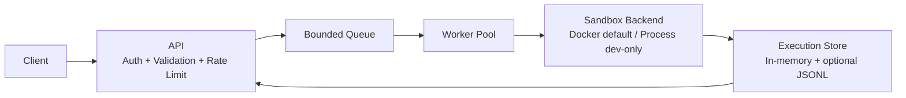

## Sandboxed Code Execution Engine

Run untrusted `python`/`javascript`/`rust`/`c` code behind a multi-tenant API with queueing, worker isolation, and strict runtime limits.

### Why this exists

- Isolate untrusted execution with per-run CPU, memory, timeout, process, and output limits.
- Keep API responsive with a bounded queue and async workers.
- Support tenant isolation with API-key auth and per-tenant rate limiting.
- Expose operational metrics via Prometheus format.

### API

| Method | Path | Purpose |
| --- | --- | --- |
| `GET` | `/healthz` | Health check |
| `GET` | `/metrics` | Prometheus counters/gauge |
| `POST` | `/v1/executions` | Submit execution job |
| `GET` | `/v1/executions/{id}` | Job status summary |
| `GET` | `/v1/executions/{id}/result` | Full result payload |

Auth header: `x-api-key`.

Default key mapping: `API_KEYS=default:dev-key`.

### Core config

| Env var | Default | Notes |
| --- | --- | --- |
| `BIND_ADDR` | `0.0.0.0:8080` | HTTP bind address |
| `WORKER_COUNT` | `4` | Number of worker tasks |
| `QUEUE_CAPACITY` | `1024` | Bounded queue size |
| `SANDBOX_BACKEND` | `docker` | `docker` or `process` |
| `API_KEYS` | `default:dev-key` | `tenant:key,tenant2:key2` |
| `RATE_LIMIT_PER_MINUTE` | `120` | Per-tenant request rate |
| `RATE_LIMIT_BURST` | `20` | Token bucket burst size |
| `NETWORK_ALLOWED_TENANTS` | empty | Tenants allowed `allow_network=true` |
| `PERSIST_RESULTS_PATH` | unset | Append JSONL records to disk |
| `LOG_LEVEL` | `info` | Tracing filter |